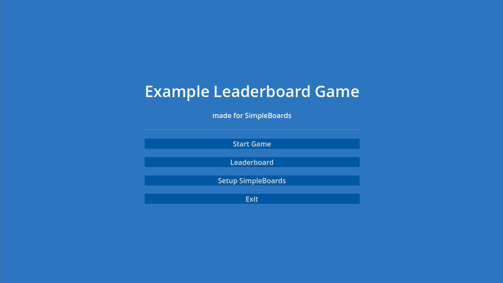
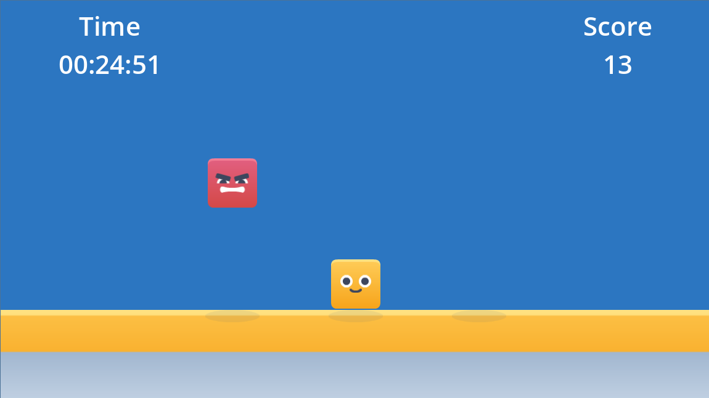
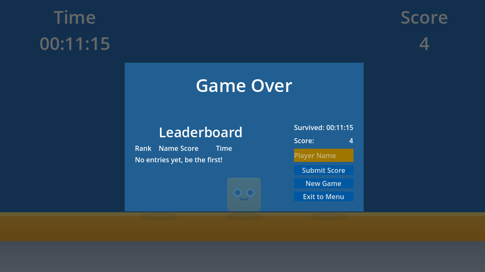
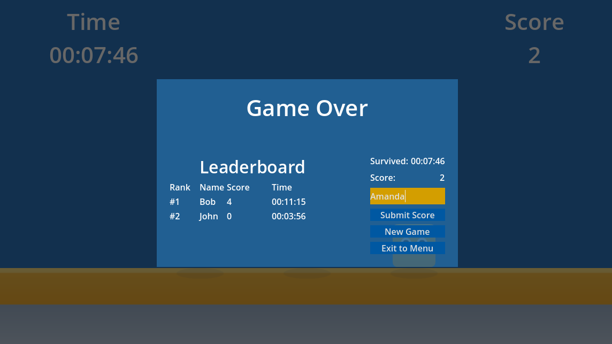
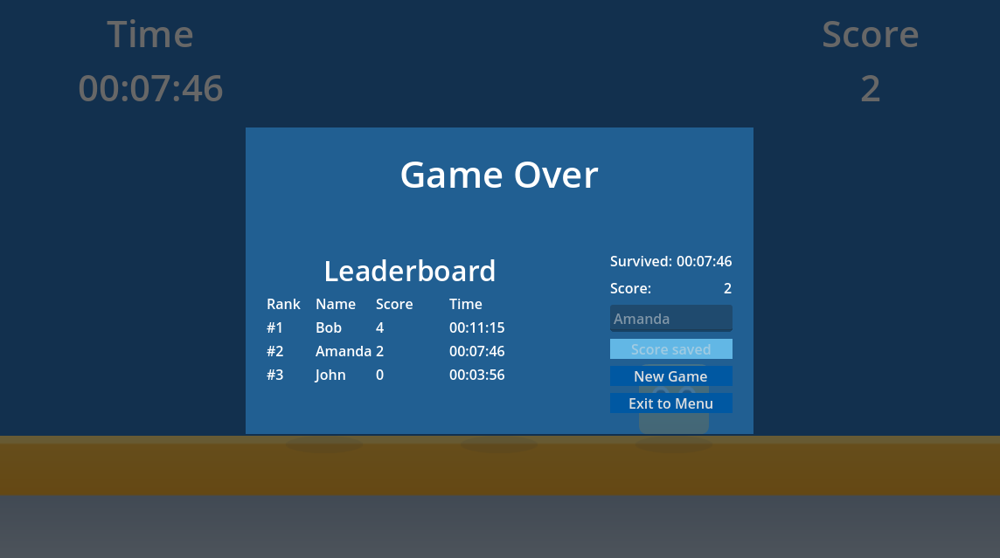
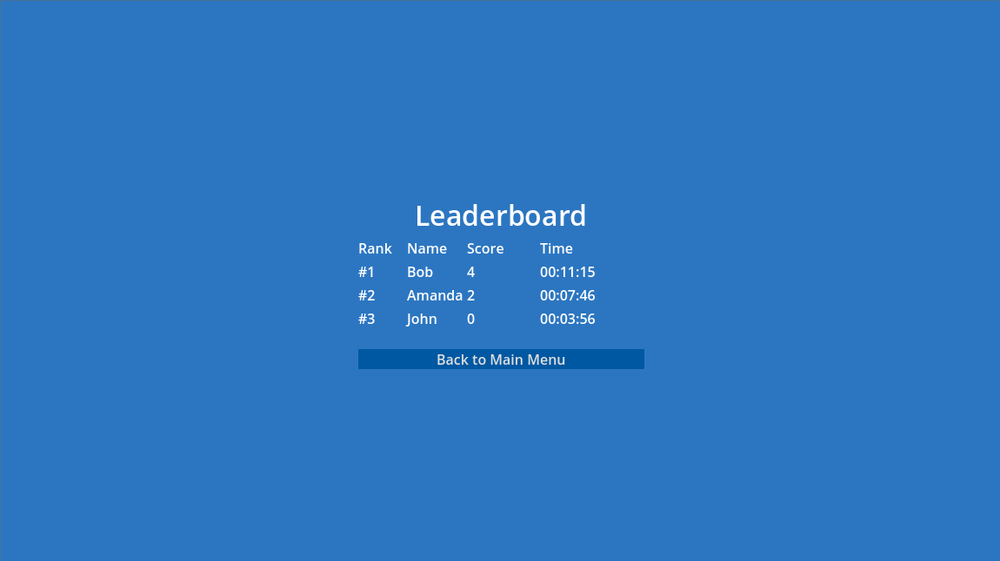

# SimpleBoards Godot 4 Leaderboard Example - Lane Dodge Game

This repository contains a **minimal, complete Godot 4 leaderboard example** demonstrating how to integrate **SimpleBoards** into a real gameplay loop.

The game is intentionally simple.  
The focus is **leaderboards, score submission, and UI flow**, not game complexity.

This project can be used as a **Godot leaderboard example, starter template, or reference implementation** for indie developers.

---

## 🎮 Game Overview

**Lane Dodge** is a top-down survival game:

- The player can move between **three lanes**
- Obstacles fall from the top
- Survive as long as possible
- Your **survival time** and **score** are submitted to a leaderboard

This project demonstrates a full, real-world leaderboard flow in a small, readable codebase.

---

## ✨ Features

- Godot 4 compatible
- Lane-based gameplay
- SimpleBoards leaderboard integration
- Score submission without user accounts
- Async submission with success and error handling
- Game Over leaderboard preview
- Full leaderboard page with ranking

---

## 👤 Who This Is For

This example is intended for:

- Godot 4 developers
- Indie game developers
- Developers looking for a simple leaderboard solution
- Anyone searching for a **Godot leaderboard example or template**

---

## 🧩 Requirements

- **Godot Engine 4.x**
- A **SimpleBoards account** (free tier is enough)

---

## 📸 Screenshots

<p>
  
  
</p>

<p>
  
  
</p>

<p>
  
  
</p>

 
---

## 🚀 Getting Started

### 1. Create a SimpleBoards Account

Go to:

https://simpleboards.dev

Register and open the **Dashboard**.

---

### 2. Create a Leaderboard

In the dashboard:

1. Create a new leaderboard
2. Copy:
   - **Leaderboard ID**
   - **API Key**

You will need both.

---

### 3. Configure the Project

Open the project in Godot.

Locate the `Leaderboard` node (or `leaderboard.gd` script) and the `GameOver` node (or `game_over.gd`).

Replace the placeholders:

```
# Get your Leaderboard ID and API key from https://simpleboards.dev/dashboard
@export var leaderboard_id := "REPLACE_WITH_YOUR_LEADERBOARD_ID"
@export var api_key := "REPLACE_WITH_YOUR_API_KEY"
```

You can set these values directly in the **Inspector**.

If you forget this step, the leaderboard will not load.

---

## 🏗 Project Structure

```
Scenes/
├── Menu.tscn
├── Game.tscn
├── GameOver.tscn
├── HUD.tscn
├── Leaderboard.tscn
├── LeaderboardPage.tscn
├── Obstacle.tscn
├── Player.tscn
├── Spawner.tscn

Scripts/
├── game.gd
├── menu.gd
├── hud.gd
├── game_over.gd
├── leaderboard.gd
├── leaderboard_page.gd
├── player.gd
├── obstacle.gd
├── spawner.gd

addons/
└── simpleboards_plugin/

Assets/
└── kenney_shape-characters/
```

---

## 🧠 Core Concepts

### Score and Time

- **Time** = how long the player survives
- **Score** = how many obstacles were avoided
- Time is also stored as **metadata** on the leaderboard entry

Example metadata:

```
00:26:14
```

---

### Game Flow

1. Player starts the game
2. Timer and score update live
3. Player hits an obstacle
4. Game Over screen appears
5. Player enters a name
6. Score is submitted to SimpleBoards
7. Leaderboard refreshes
8. Player can replay or return to menu

---

## 📡 SimpleBoards Integration

### Submitting a Score

Scores are submitted **without user accounts**, using:

- Leaderboard ID
- Player name
- Score
- Metadata (time)

The UI handles:

- Submitting state
- Success feedback
- Failure recovery

This mirrors how SimpleBoards is intended to be used in real indie games.

---

### Leaderboard Display

The leaderboard shows:

```
Rank | Name | Score | Time
```

- Rankings are calculated from the returned order
- Empty leaderboards show a friendly message
- Errors are handled gracefully

---

## 🛠 Customization Ideas

You can easily extend this example:

- Add daily or weekly leaderboards
- Highlight the player’s own entry
- Add pagination
- Store structured metadata (JSON)
- Replace dynamic rows with reusable prefabs

The code is intentionally simple and readable to encourage experimentation.

---

## 🔒 Security Notes

This example uses **client-side score submission**.

This is suitable for:
- Prototypes
- Indie games
- Non-competitive leaderboards

For authoritative or anti-cheat-sensitive games, server-side validation is recommended.

---

## 🤏 Why This Example Is Simple

This project is intentionally minimal.

The goal is to answer:

“How do I add leaderboards to my Godot 4 game in 10 minutes?”

Not to build a full game.

---

## 🧾 License

You are free to:

- Use this project
- Modify it
- Ship it
- Learn from it

No attribution required.

---

## 🎨 Assets & Credits

This project uses visual assets from **Kenney**:

- **Shape Characters Pack**  
  https://kenney.nl/assets/shape-characters

Kenney assets are licensed under the **Creative Commons CC0 1.0 Universal** license, which allows free use in both personal and commercial projects, with no attribution required.

That said, crediting Kenney is highly encouraged and appreciated.

Learn more at:  
https://kenney.nl

---

## 🌐 Learn More

- SimpleBoards website: https://simpleboards.dev
- SimpleBoards documentation: https://simpleboards.dev/docs
- Dashboard: https://simpleboards.dev/dashboard
- SimpleBoards Godot asset: https://github.com/isetr/simpleboards_godot

---

## ✅ Final Notes

If you are:

- An indie developer
- Using Godot
- Shipping a small game
- Or just need leaderboards fast

This project shows the **intended SimpleBoards workflow** from start to finish.
